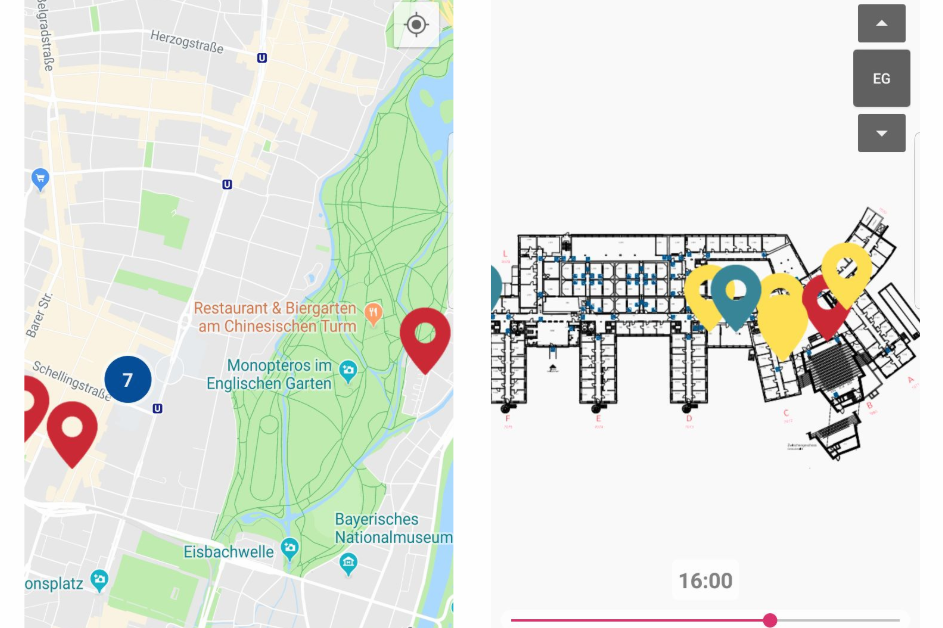

<!--  -->

&nbsp;

<!-- 
 -->
::: asd
    Which lectures and free rooms are around me? With this question in mind, we built a unique **Android** app, focussing on an easy and accessible way to get location aware information.  
:::
<!-- 
     -->

&nbsp;

The project contains a backend written in **Java Spring** and accesses a **Mongo Database** with the crawled data we gained via **Jaunt** from the course catalog **LSF**.

The frontend was written in **Kotlin** for **Android**, connecting to the backend via a **Rest API**.