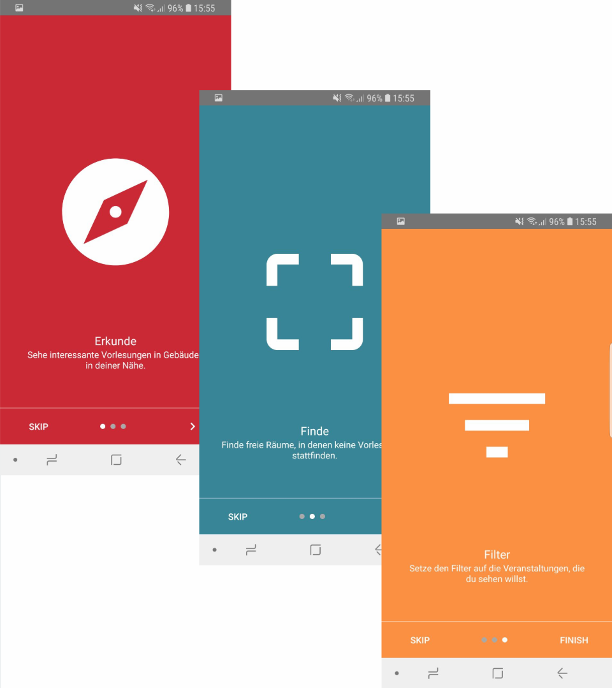

{height="14em"} \

&nbsp;

$project_description$ With this question in mind, we built a unique Android app, focussing on an easy an accessible way to get location aware information.  

&nbsp;

{height="14em"} \