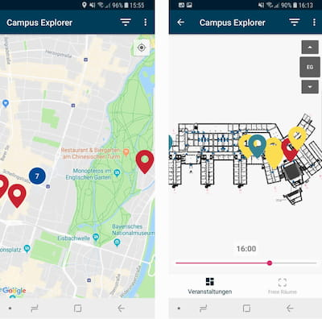

::: right
\
_The explore and find stages._
:::

## Which lectures and free rooms are around me?

&nbsp;

With this question in mind, we built a unique Android app, focussing on an easy and accessible way to get location aware information.  

In the app, the user can search any buildings around them for running courses as well as free rooms.

&nbsp;

To get this information, we crawled the [course catalog](https://lsf.verwaltung.uni-muenchen.de/qisserver/rds?state=user&type=5&language=en) for all running courses and matched this information with the building data from the [LMU Raumfinder app](https://www.uni-muenchen.de/raumfinder/index.html#/).

&nbsp;

The frame for project this was a [lab course on location aware apps](http://www.mobile.ifi.lmu.de/lehrveranstaltungen/msp-ws1819/) with the [chair of mobile and distributed systems](http://www.mobile.ifi.lmu.de/).

&nbsp;

::: left
\
:::

## Tech Stack

&nbsp;

The project includes a backend written in [Java Spring](https://spring.io/) and accesses a Mongo Database with the crawled data we gained via the crawling library [Jaunt](https://jaunt-api.com/) from the course catalog. 

Frontend-wise, we used Kotlin for Android, connecting to the backend via a Rest API interface.

&nbsp;

All of our code can be found on Github and is available under the MIT License: The backend on [campusExplorerServer](https://github.com/beneseifert/campusExplorerServer) and the frontend on [campusExplorerClient](https://github.com/alexanderperzl/campusExplorerClient).

&nbsp;

Using server-side filtering, the client only receives the data it needs and can then efficiently and locally apply their content filtering, e.g. what type of courses and faculties they are interested in. Internally, the app caches all room plans after receiving them once to save time when revisiting a building.

&nbsp;

::: right
\
_The intro: explore, find, filter._
:::

## App Workflow

&nbsp;

When the user first opens up the app, they are presented with a quick intro into the main features of the app: explore, find and filter.

&nbsp;

The app contains a explore stage where they can explore the area around them and find university buildings. 
After selecting one of the buildings, the user finds a floor plan on which they can find all the lectures or free rooms. 

&nbsp;

Here, they can choose the time by adjusting a slider and receive more information about a specific room by selecting the marker on the room plan.