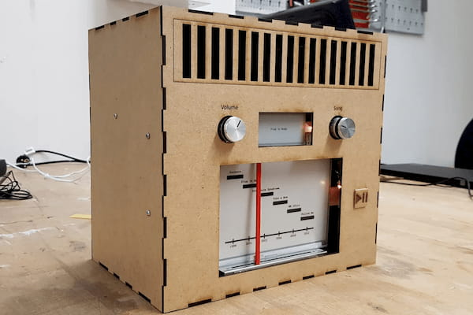
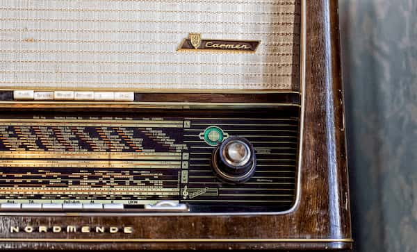
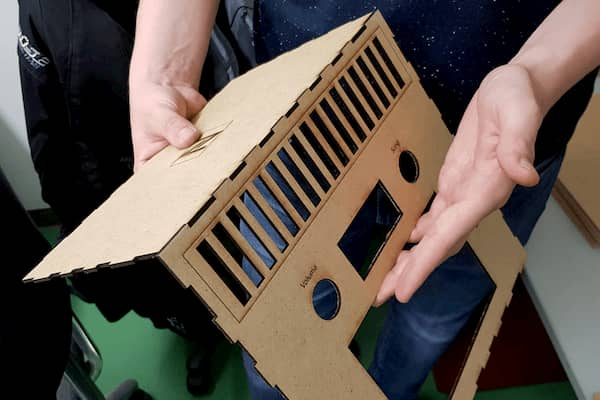

::: article
::: paragraph
::: text
## New Features, Classic Design?

&nbsp;

In a lab project at the [department of human-centered ubiquitous media](https://www.en.um.informatik.uni-muenchen.de/index.html) we were challenged to create a modern music player which references traditional radio design.  

&nbsp; 

Our prototype has two e-paper screens, one showing the currently playing song and one showing a selection of songs of a particular genre.  

&nbsp; 

The song selection is analog to the radio station selection on FM radios: Just move the red bar over the desired song on the timeline and enjoy.
To choose a genre, just place a new nfc tag on top of the device.
::: 

::: image
 \

::: caption
Our complete NFC Radio.
::: 
:::
:::

::: paragraph

::: image
 \

::: caption
German radio receiver "Carmen" from Nordmende, image from [flickr](https://www.flickr.com/photos/lanier67/7162468903).
:::
:::

::: text
## Classic Radio Elements

&nbsp;

Devices from the likes of Braun, Grundig, Nordmende and Telefunken have inspired our project to create a modern radio device with the majestic looks of the past.

&nbsp;

Thus, our radio is made out of wood, with warm-colored miniature light bulbs and very haptic dials to turn.  

&nbsp;

With e-ink displays, the device never distracts by being overly bright or unnatural-looking.
:::
:::

::: paragraph
::: text
## Construction Process

&nbsp;

Our final prototype contains two Raspberry Pis as well as an Arduino to drive the two e-ink displays, an NFC reader as well as all the analog potentiometers and motors.  

&nbsp;

We laser-cut our case out of MDF wood and engraved labels for "Volume", "Song", "Play" and the NFC-reader on top.

&nbsp;

On the bottom of our larger screen we've mounted a motorized fader, usually known from mixer consoles, to move the physical red bar across the screen.  
::: 

::: image
 \

::: caption
Laser cutting to cunstruct our wooden radio.
::: 
:::
:::

::: paragraph
::: image
::: video
<iframe src="https://www.youtube.com/embed/Fbv3RyXO0YM" title="YouTube video of the NFC radio." frameborder="0" allow="accelerometer; autoplay; encrypted-media; gyroscope; picture-in-picture" allowfullscreen></iframe>
:::
:::

::: text
## The Working Prototype

&nbsp;

You can find the code on [github](https://github.com/benedikt-mayer/nfcradio) available under the MIT license, along with installation instructions. 

&nbsp;

We've also written a popular instruction guide about the device featured on [intructables](https://www.instructables.com/id/NFC-Timeline-Radio/).  

&nbsp;

The guide contains all the laser cutting files, part recommendations, fritzing sketches as well as a plethora of images of the construction process.
:::
:::
:::