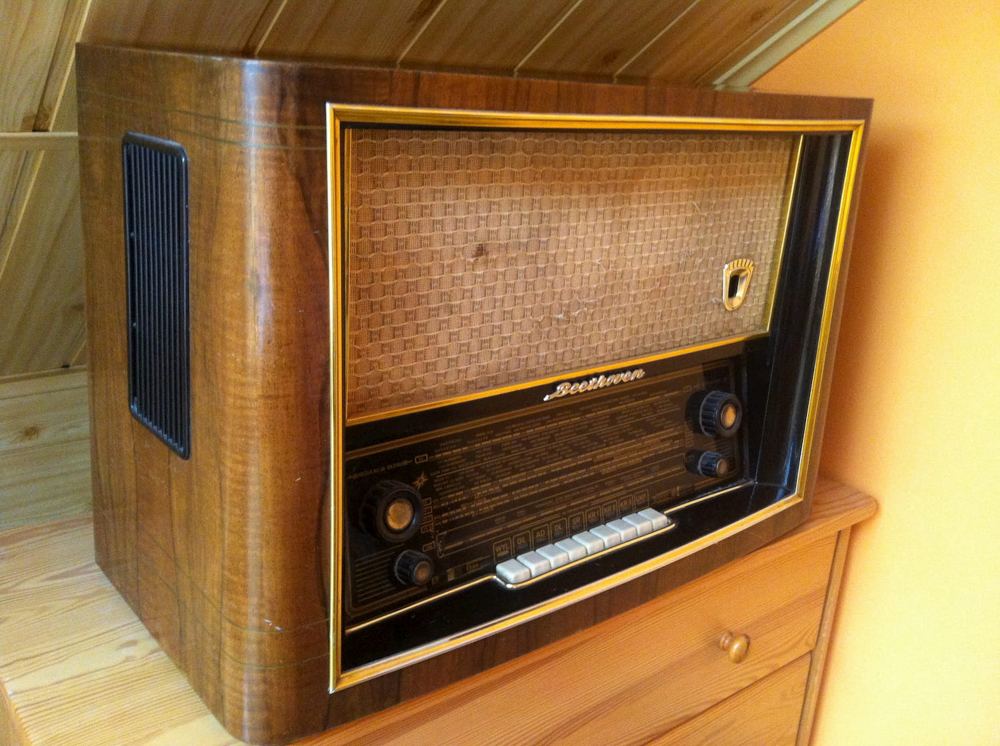

::: article
::: paragraph
::: text
## New features, classic design?

&nbsp;

$project_description$
::: 

::: image
{height="20em"} \

::: caption
Our laser-cut NFC Radio.
::: 
:::
:::

::: paragraph

::: image
{height="20em"} \

::: caption
German radio receiver "Stern-Radio Rochlitz Beethoven", image from [wikimedia](https://commons.wikimedia.org/wiki/File:Stern-Radio_Rochlitz_Beethoven.JPG).
:::
:::

::: text
## Classic Radio elements
:::
:::

<iframe width="100%" height="100%" src="https://www.youtube.com/embed/Fbv3RyXO0YM" frameborder="0" allow="accelerometer; autoplay; encrypted-media; gyroscope; picture-in-picture" allowfullscreen>
</iframe>
:::