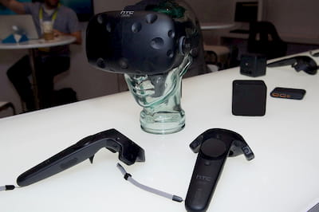
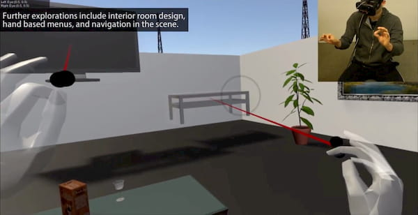

::: article
::: paragraph
::: text
## Eye-Tracking and Gestures in VR

&nbsp;

Lorem ipsum dolor sit amet, consectetur adipiscing elit. Morbi viverra velit quis dolor ultricies tincidunt. Vestibulum at venenatis nisl, non eleifend libero. Curabitur sodales et ipsum at venenatis. Cras dui ipsum, eleifend eu malesuada id, tempor at lectus. Vivamus dictum, mi et condimentum dictum, velit purus dignissim leo, nec scelerisque nisi eros viverra mauris. Curabitur vulputate urna nibh. Maecenas vel tortor ac est lobortis euismod scelerisque sit amet libero. Etiam vel pulvinar velit. Vestibulum porta, nunc et dictum accumsan, nibh libero vestibulum lorem, et ultricies arcu metus scelerisque odio. Interdum et malesuada fames ac ante ipsum primis in faucibus. Sed.

::: 

::: image
 \

::: caption
Basic 3D interaction with eye gaze + hand pinching.
::: 
:::
:::

::: paragraph

::: image
 \

::: caption
HTC Vive headset and controllers. Image from [ETC-USC on flickr](https://www.flickr.com/photos/92587836@N04/24177102722/).
:::
:::

::: text
## Immersive and intuitive Interaction

&nbsp;

Lorem ipsum dolor sit amet, consectetur adipiscing elit. Morbi viverra velit quis dolor ultricies tincidunt. Vestibulum at venenatis nisl, non eleifend libero. Curabitur sodales et ipsum at venenatis. Cras dui ipsum, eleifend eu malesuada id, tempor at lectus. Vivamus dictum, mi et condimentum dictum, velit purus dignissim leo, nec scelerisque nisi eros viverra mauris. Curabitur vulputate urna nibh. Maecenas vel tortor ac est lobortis euismod scelerisque sit amet libero. Etiam vel pulvinar velit. Vestibulum porta, nunc et dictum accumsan, nibh libero vestibulum lorem, et ultricies arcu metus scelerisque odio. Interdum et malesuada fames ac ante ipsum primis in faucibus. Sed.
:::
:::

::: paragraph
::: text
## Expanding the Concept

&nbsp;

Lorem ipsum dolor sit amet, consectetur adipiscing elit. Morbi viverra velit quis dolor ultricies tincidunt. Vestibulum at venenatis nisl, non eleifend libero. Curabitur sodales et ipsum at venenatis. Cras dui ipsum, eleifend eu malesuada id, tempor at lectus. Vivamus dictum, mi et condimentum dictum, velit purus dignissim leo, nec scelerisque nisi eros viverra mauris. Curabitur vulputate urna nibh. Maecenas vel tortor ac est lobortis euismod scelerisque sit amet libero. Etiam vel pulvinar velit. Vestibulum porta, nunc et dictum accumsan, nibh libero vestibulum lorem, et ultricies arcu metus scelerisque odio. Interdum et malesuada fames ac ante ipsum primis in faucibus. Sed.
::: 

::: image
 \

::: caption
In a 3D living room scene, the user can rearrange their furniture by using gaze + pinch.
::: 
:::
:::

::: paragraph
::: image
::: video
<iframe src="https://www.youtube.com/embed/NzLrZSF8aDM" frameborder="0" allow="accelerometer; autoplay; encrypted-media; gyroscope; picture-in-picture" allowfullscreen></iframe>
:::
:::

::: text
## Gaze+Pinch in Action

&nbsp;

The paper was published to [ACM Digital Library](https://dl.acm.org/citation.cfm?id=3132180) for [the 5th ACM Symposium on Spatial User Interaction (SUI 2017)](http://www.sui2017.org/). You can find more publications of mine on [Google Scholar](https://scholar.google.de/citations?user=ZHmZq24AAAAJ&hl=en). There is also a [full talk about the Gaze+Pinch paper](https://www.youtube.com/watch?v=YdKT42tZdQE) given by my colleague Ken Pfeuffer at SUI 2017.
:::
:::

:::